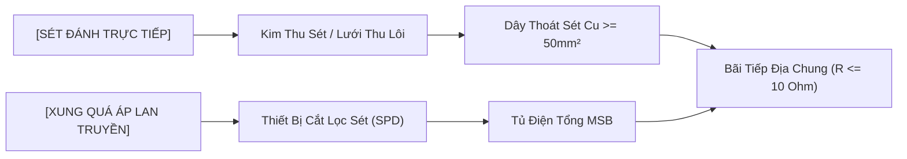

`[SYS-06.01]` | `[STD: TCVN 9385 & IEC 62305]` | `[STATUS: ACTIVE]` | `[DISCIPLINE: M&E / PROTECTION]`

# Lightning System (Hệ thống Chống sét)

> [!ABSTRACT] HỒ SƠ ĐẶC TẢ KỸ THUẬT (CORE SPECIFICATIONS)
> Hệ thống bảo vệ công trình, con người và thiết bị trước tác động nguy hiểm của dòng sét đánh trực tiếp và xung lan truyền theo tiêu chuẩn quốc gia **TCVN 9385:2012** và tiêu chuẩn quốc tế **IEC 62305**.

---

## [01] BẢNG THÔNG SỐ CỐT LÕI (CORE SPECS)

| Cấp Bảo Vệ (LPL) | Bán Kính Quả Cầu ($R$) | Kích Thước Lưới Thu Sét | Góc Bảo Vệ ($\alpha$ tại $h=20\text{ m}$) | Hiệu Quả Bảo Vệ |
| :---: | :---: | :---: | :---: | :---: |
| **Cấp I** | $20\text{ m}$ | $5 \times 5\text{ m}$ | $25^\circ$ | $98\%$ |
| **Cấp II** | $30\text{ m}$ | $10 \times 10\text{ m}$ | $35^\circ$ | $95\%$ |
| **Cấp III** | $45\text{ m}$ | $15 \times 15\text{ m}$ | $45^\circ$ | $88\%$ |
| **Cấp IV** | $60\text{ m}$ | $20 \times 20\text{ m}$ | $55^\circ$ | $80\%$ |

---

## [02] SƠ ĐỒ PHỐI HỢP BẢO VỆ CHỐNG SÉT

---

## [03] 3 PHƯƠNG PHÁP THIẾT KẾ BẢO VỆ CHỐNG SÉT

### ◈ 1. Phương pháp Quả cầu lăn (Rolling Sphere Method - RSM)
* **Nguyên lý**: Áp dụng cho mọi dạng hình khối phức tạp của công trình. Dùng một quả cầu ảo có bán kính $R$ (tương ứng với cấp bảo vệ) lăn trên mọi bề mặt công trình.
* **Vùng bảo vệ**: Toàn bộ không gian nằm dưới mặt cầu và không bị cầu chạm tới được coi là an toàn. Mọi điểm tiếp xúc của quả cầu trên công trình đều là điểm có nguy cơ bị sét đánh và cần bố trí bộ phận thu sét.

### ◈ 2. Phương pháp Lưới thu sét (Mesh Method - MM)
* **Nguyên lý**: Áp dụng tối ưu cho các bề mặt phẳng, mái bằng hoặc sân thượng công trình.
* **Cấu tạo**: Sử dụng các dây kim loại liên kết đan xen thành các ô lưới khép kín. Các cạnh lưới phải đi sát mép ngoài của mái công trình và liên kết đẳng thế trực tiếp về các dây thoát sét xuống đất.

### ◈ 3. Phương pháp Góc bảo vệ (Protective Angle Method - PAM)
* **Nguyên lý**: Thích hợp cho các kim thu sét đơn lẻ hoặc công trình có hình khối đơn giản, đối xứng.
* **Đặc tính**: Vùng bảo vệ là hình nón xoay quanh trục kim với góc mở $\alpha$. Chiều cao kim $h$ càng lớn thì góc bảo vệ $\alpha$ càng thu hẹp nhằm đảm bảo an toàn tuyệt đối.

---

## [04] LIÊN KẾT HỆ THỐNG
* Hệ thống tiếp địa an toàn: [[Earthing & Grounding System]]
* Nhóm hệ thống: [[Protection System]]
